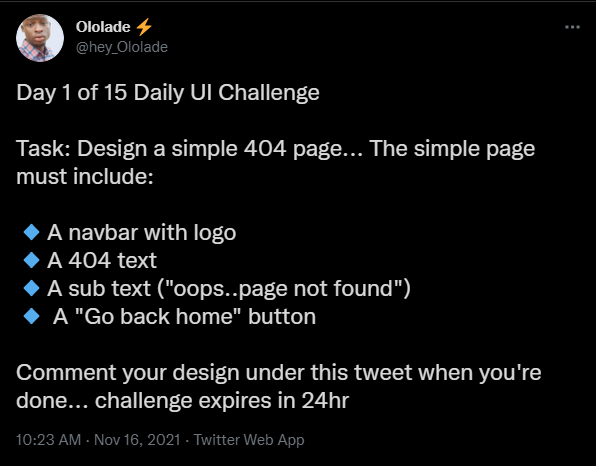
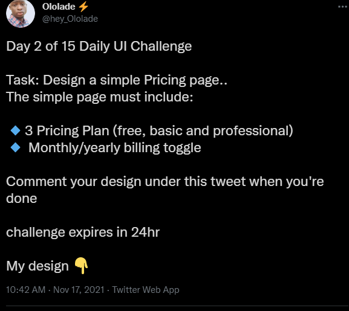
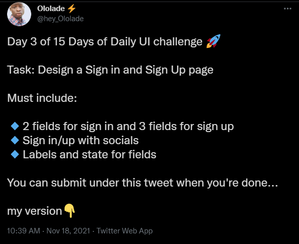

# 15 UI Design projects in HTML5 & CSS3 :art: ✔️

### Day 1
- 404 pages
  

### Day 2
- Pricing pages

### Day 3 
- Signup and Login pages

### Day 4
- 
  

### Day 5
- 

### Day 6 
- 

### Day 7
- 

### Day 8
- 

### Day 9 
- 

### Day 10
- 

### Day 11
- 

### Day 12
- 

